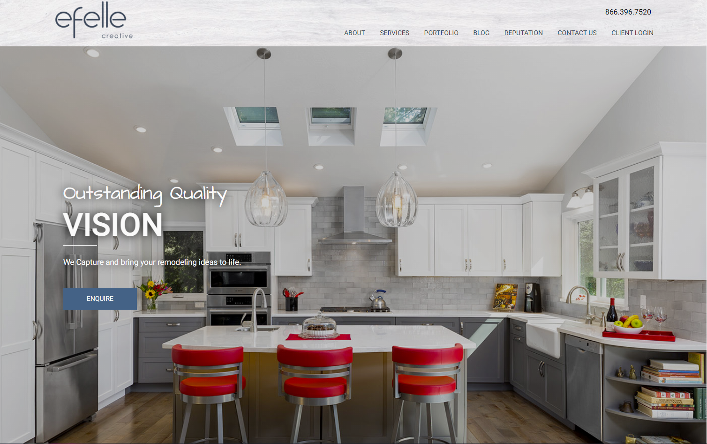
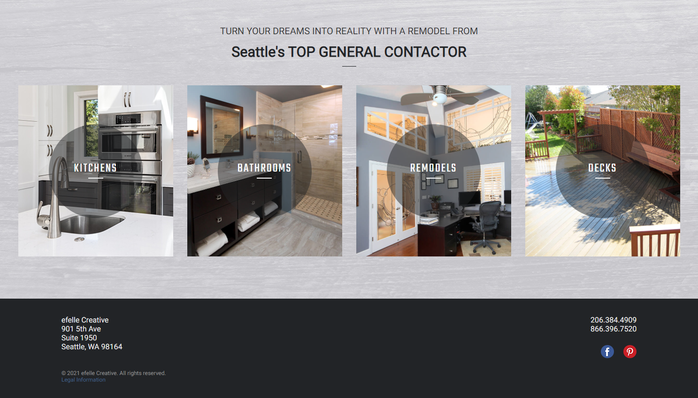
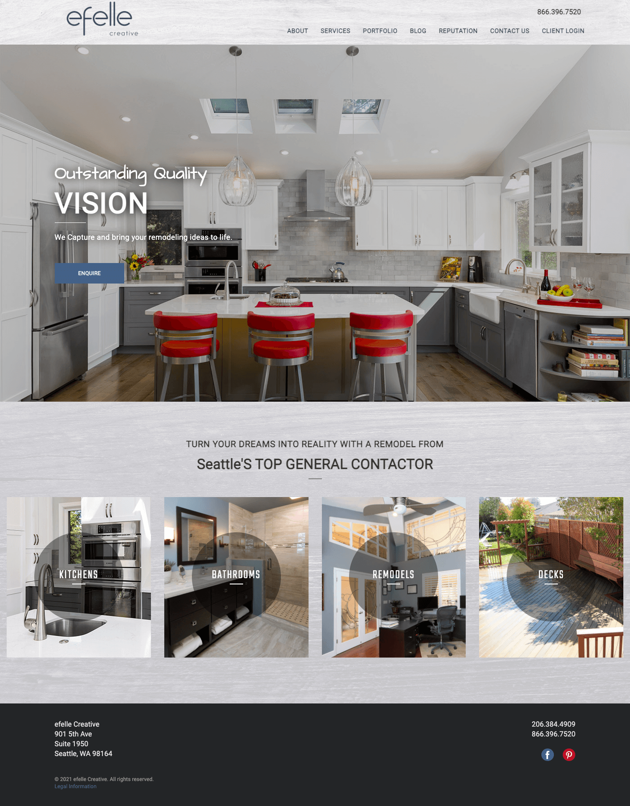

# efelle-construction  
  

efelle Front-End Sweb Developer challenge: A creative front-end application built using only HTML & CSS.  

**[Visit the Deployed Site](https://sheplt1.github.io/efelle-construction/)**  

## Features
- Mobile responsive design
- Sticky header
- Main banner with auto-adjusted height
- CSS transitions for nav links, banner button, and service spotlight hover states
- Nearly identical to example

## Preview

## Example
